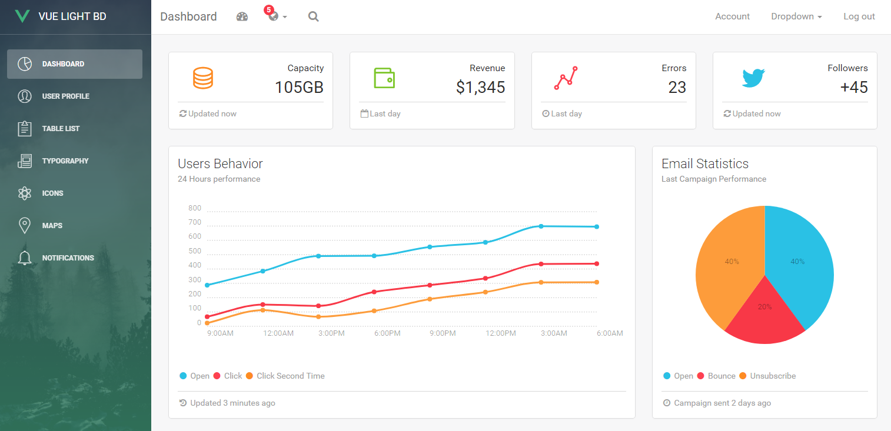

# Shop's Baby Sister

> A tool that helps managing products, orders, stock, customers & suppliers for small shops

This project is built on top of Vue js with [Vue Light Bootstrap Dashboard](https://www.creative-tim.com/product/vue-light-bootstrap-dashboard) template. The dashboard includes Bootstrap 4, vue-router, chartist, google-maps and several other plugins/components.

Check the [ShopSister's Live Demo here](https://shopsister.herokuapp.com).

## :rocket: Getting started

Shop's Baby Sister is built on top of Bootstrap 4, Vuejs and Vue-router. To get started do the following steps:
1. Download the project
2. Make sure you have node.js (https://nodejs.org/en/) installed
3. Type `npm install` in the source folder where `package.json` is located
4. Type `npm run dev` to start the development server

The repo uses [vue-cli](https://github.com/vuejs/vue-cli) scaffolding which takes care of the development setup with webpack and all the necessary modern tools to make web development faster and easier.

### [Template Documentation](https://cristijora.github.io/vue-light-bootstrap-dashboard/documentation/#/buttons)

## :cloud: Build Setup

### install dependencies
`npm install`
### serve with hot reload at localhost:8000
`npm run dev`
### build for production with minification
`npm run build`
### run unit tests
`npm run unit`
### run and watch unit tests
`npm run unit:watch`

## :clipboard: Database Overview
- products(name, unit, price, description, images, external_urls)
- customers(name, phone_number, notes, external_urls)
- suppliers(name, phone_number, notes, external_urls)
- orders(customer_id, item_total, shipment_total, adjustment_total, total, payment_state, shipment_state, state(:requested, :confirming, :processing, :delivering, :completed, :returned), notes)
- order_items(order_id, product_id, price, quantity)
- purchase_orders(supplier_id, item_total, shipment_total, adjustment_total, total, payment_state, shipment_state, state(:requested, :confirming, :processing, :completed), notes)
- purchase_order_items(purchase_order_id, product_id, price, quantity)
notes:
- external_urls can be facebook, shopee, taobao... urls
